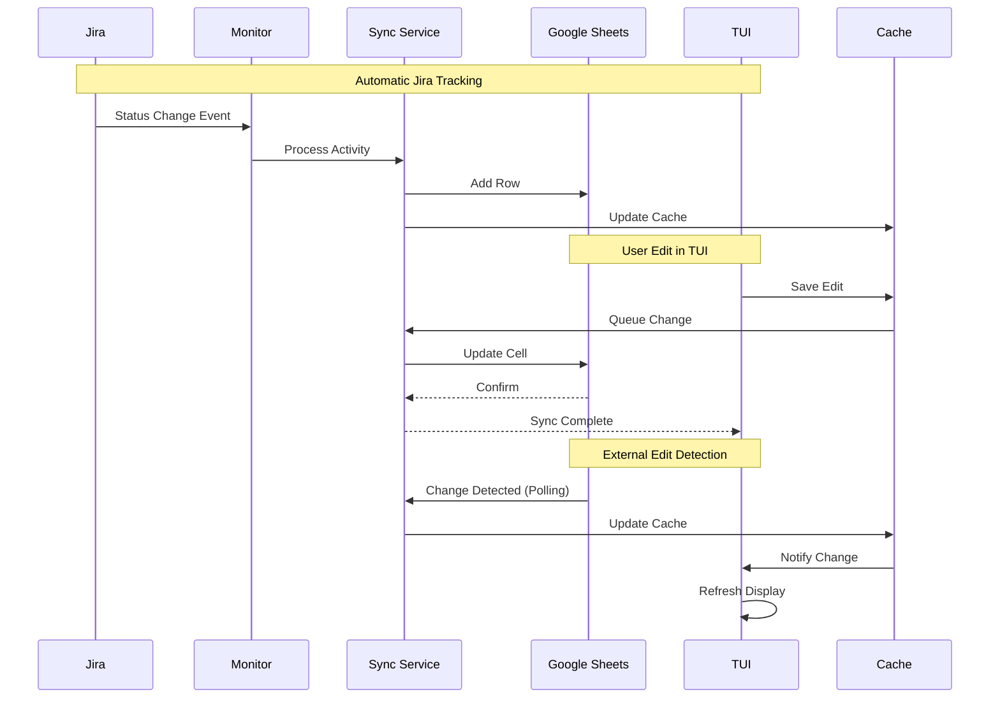

# Google Sheets TUI Integration - Technical Documentation

## Table of Contents
1. [Overview](#overview)
2. [Architecture](#architecture)
3. [Google Sheets Schema](#google-sheets-schema)
4. [API Specifications](#api-specifications)
5. [Sync Protocol](#sync-protocol)
6. [Implementation Phases](#implementation-phases)
7. [Security & Authentication](#security--authentication)
8. [Error Handling](#error-handling)

## Overview

### Purpose
Create a bidirectional synchronization system between Google Sheets and a Terminal User Interface (TUI) for managing daily standup notes, with automatic Jira activity tracking.

### Key Features
- **Real-time bidirectional sync** between TUI and Google Sheets
- **Automatic Jira activity tracking** and sheet population
- **Collaborative editing** with multi-user support
- **Offline capability** with sync queue
- **Conflict resolution** with timestamp-based merging

### System Components
1. **Google Sheets API Service** - Handles read/write operations
2. **Jira Activity Monitor** - Tracks ticket activities
3. **Sync Coordinator** - Manages bidirectional sync
4. **TUI Application** - Interactive spreadsheet interface
5. **SQLite Cache** - Local data storage and offline queue

## Architecture

### High-Level Architecture
```
┌─────────────────────────────────────────────────────────────────┐
│                        Google Sheets API                         │
│                     (Source of Truth - Cloud)                    │
└────────────────────────────┬───────────────────────────────────┘
                             │ HTTPS/REST
                             ▼
┌─────────────────────────────────────────────────────────────────┐
│                     Sync Coordinator Service                     │
│  • Conflict Resolution  • Version Control  • Queue Management    │
└──────────┬──────────────────┬──────────────────┬───────────────┘
           │                  │                  │
           ▼                  ▼                  ▼
    ┌──────────┐      ┌──────────┐      ┌──────────┐
    │   Jira   │      │  SQLite  │      │   TUI    │
    │  Monitor │      │  Cache   │      │   App    │
    └──────────┘      └──────────┘      └──────────┘
```

### Data Flow Diagram


## Google Sheets Schema

### Primary Sheet Structure

| Column | Field Name | Type | Description | Example |
|--------|------------|------|-------------|---------|
| A | Date | DATE | Standup date | 2025-09-06 |
| B | Ticket | STRING | Jira ticket key | VIS-5384 |
| C | Summary | STRING | Ticket summary | [SWIFT] View Details |
| D | Status | STRING | Current status | In Progress |
| E | Work Done | TEXT | Description of work | Fixed QR generation bug |
| F | Notes | TEXT | Additional notes | Needs review |
| G | Updated At | DATETIME | Last update timestamp | 2025-09-06 14:30:00 |
| H | Updated By | STRING | User who updated | john.doe@company.com |
| I | Sync Status | STRING | Sync state | synced |
| J | Version | INTEGER | Row version number | 3 |

### Metadata Sheet (Hidden)

| Column | Field Name | Type | Description |
|--------|------------|------|-------------|
| A | Config Key | STRING | Configuration parameter |
| B | Config Value | STRING | Parameter value |
| C | Last Sync | DATETIME | Last successful sync |
| D | Schema Version | STRING | Current schema version |

### Example Data Format
```json
{
  "date": "2025-09-06",
  "ticket": "VIS-5384",
  "summary": "[SWIFT] View Visit Details in QR",
  "status": "Done",
  "work_done": "Fixed QR generation issue, tested on staging",
  "notes": "Ready for production",
  "updated_at": "2025-09-06T14:30:00Z",
  "updated_by": "user@company.com",
  "sync_status": "synced",
  "version": 3
}
```

## API Specifications

### Google Sheets Service API

```python
class GoogleSheetsService:
    """Service for Google Sheets operations."""

    def authenticate(self, credentials_path: str) -> bool:
        """Authenticate with Google Sheets API."""

    def read_range(self, range: str) -> List[List[Any]]:
        """Read data from specified range."""

    def write_cell(self, row: int, col: str, value: Any) -> bool:
        """Write value to specific cell."""

    def batch_update(self, updates: List[CellUpdate]) -> bool:
        """Perform batch updates to multiple cells."""

    def append_row(self, values: List[Any]) -> int:
        """Append new row and return row number."""

    def watch_changes(self, callback: Callable) -> None:
        """Start watching for sheet changes."""

    def get_metadata(self) -> Dict[str, Any]:
        """Get sheet metadata including version."""
```

### Jira Activity Monitor API

```python
class JiraActivityMonitor:
    """Monitor Jira for activity changes."""

    def start_monitoring(self, interval: int = 300) -> None:
        """Start monitoring with specified interval."""

    def get_recent_activities(self, since: datetime) -> List[Activity]:
        """Get activities since timestamp."""

    def track_ticket_changes(self, ticket_key: str) -> List[Change]:
        """Track specific ticket changes."""

    def detect_work_patterns(self) -> List[WorkPattern]:
        """Detect work patterns from activities."""
```

### Sync Coordinator API

```python
class SyncCoordinator:
    """Coordinate bidirectional synchronization."""

    def sync_to_sheets(self, changes: List[Change]) -> SyncResult:
        """Sync local changes to Google Sheets."""

    def sync_from_sheets(self) -> List[Change]:
        """Pull changes from Google Sheets."""

    def resolve_conflict(self, local: Change, remote: Change) -> Change:
        """Resolve sync conflicts."""

    def queue_offline_change(self, change: Change) -> None:
        """Queue change for later sync."""

    def process_sync_queue(self) -> SyncResult:
        """Process queued changes."""
```

## Sync Protocol

### Sync States
```
IDLE → CHECKING → SYNCING → RESOLVING → COMPLETE
  ↑                                        │
  └────────────────────────────────────────┘
```

### Conflict Resolution Strategy

1. **Timestamp-Based Resolution**
   ```python
   def resolve_conflict(local_change, remote_change):
       if local_change.timestamp > remote_change.timestamp:
           return local_change  # Local wins
       else:
           return remote_change  # Remote wins
   ```

2. **Version-Based Resolution**
   ```python
   def resolve_by_version(local, remote):
       if local.version == remote.version - 1:
           return remote  # Remote is newer
       elif remote.version == local.version - 1:
           return local   # Local is newer
       else:
           return merge_changes(local, remote)  # Merge required
   ```

### Sync Flow Pseudocode
```python
async def sync_cycle():
    # 1. Check for local changes
    local_changes = cache.get_pending_changes()

    # 2. Check for remote changes
    remote_changes = sheets.get_changes_since(last_sync)

    # 3. Detect conflicts
    conflicts = detect_conflicts(local_changes, remote_changes)

    # 4. Resolve conflicts
    for conflict in conflicts:
        resolved = resolve_conflict(conflict)
        apply_resolution(resolved)

    # 5. Apply non-conflicting changes
    apply_remote_changes(remote_changes - conflicts)
    push_local_changes(local_changes - conflicts)

    # 6. Update sync metadata
    update_sync_timestamp()
    update_version_numbers()
```

## Implementation Phases

### Phase 1: Foundation (Week 1)
- [ ] Set up Google Sheets API authentication
- [ ] Create sheet schema and template
- [ ] Implement basic read/write operations
- [ ] Create SQLite cache schema
- [ ] Build simple TUI with static data

### Phase 2: Basic Sync (Week 2)
- [ ] Implement unidirectional sync (Sheets → TUI)
- [ ] Add cell editing in TUI
- [ ] Implement push changes (TUI → Sheets)
- [ ] Add basic conflict detection
- [ ] Create sync status indicators

### Phase 3: Jira Integration (Week 3)
- [ ] Build Jira activity monitor
- [ ] Implement activity detection algorithms
- [ ] Auto-populate sheet with activities
- [ ] Add activity filtering and rules
- [ ] Create activity history tracking

### Phase 4: Advanced Features (Week 4)
- [ ] Implement real-time collaboration
- [ ] Add offline queue management
- [ ] Build conflict resolution UI
- [ ] Add formula support in TUI
- [ ] Create backup and recovery system

### Phase 5: Polish & Testing (Week 5)
- [ ] Performance optimization
- [ ] Error handling improvements
- [ ] User documentation
- [ ] Integration testing
- [ ] Deployment preparation

## Security & Authentication

### Authentication Flow
```
1. Initial Setup:
   User → OAuth2 Consent → Google Auth → Access Token → Keyring Storage

2. Runtime Auth:
   TUI → Keyring → Access Token → Google Sheets API
                         ↓
                    Refresh if expired
```

### Required Scopes
```python
SCOPES = [
    'https://www.googleapis.com/auth/spreadsheets',  # Read/Write sheets
    'https://www.googleapis.com/auth/drive.metadata.readonly',  # Sheet metadata
]
```

### Token Management
```python
class TokenManager:
    def store_token(self, token: Token) -> None:
        """Securely store token in keyring."""
        keyring.set_password("helper-cli", "google-token", token.to_json())

    def get_token(self) -> Optional[Token]:
        """Retrieve token from keyring."""
        token_json = keyring.get_password("helper-cli", "google-token")
        return Token.from_json(token_json) if token_json else None

    def refresh_token(self, token: Token) -> Token:
        """Refresh expired token."""
        if token.expired:
            return oauth2.refresh(token)
        return token
```

## Error Handling

### Error Categories

1. **Network Errors**
   - Connection timeout
   - API rate limiting
   - Network unavailable

2. **Sync Errors**
   - Version conflicts
   - Data validation failures
   - Schema mismatches

3. **Authentication Errors**
   - Token expired
   - Insufficient permissions
   - Invalid credentials

### Error Recovery Strategies

```python
class ErrorRecovery:
    @retry(max_attempts=3, backoff=exponential)
    def sync_with_retry(self, data):
        """Retry sync with exponential backoff."""
        try:
            return self.sync(data)
        except NetworkError as e:
            if e.is_timeout:
                return self.queue_for_later(data)
            raise

    def handle_conflict(self, conflict):
        """Handle sync conflicts."""
        if conflict.is_resolvable:
            return self.auto_resolve(conflict)
        else:
            return self.prompt_user_resolution(conflict)

    def recover_from_corruption(self):
        """Recover from data corruption."""
        backup = self.load_last_backup()
        if self.validate_backup(backup):
            self.restore_from_backup(backup)
        else:
            self.rebuild_from_sheets()
```

### Logging Strategy

```python
import logging

# Configure structured logging
logging.basicConfig(
    format='%(asctime)s - %(name)s - %(levelname)s - %(message)s',
    level=logging.INFO
)

# Log sync events
logger.info("Sync started", extra={
    "event": "sync_start",
    "timestamp": datetime.now().isoformat(),
    "changes_pending": len(pending_changes)
})

# Log errors with context
logger.error("Sync failed", extra={
    "event": "sync_error",
    "error_type": "conflict",
    "affected_rows": [1, 5, 7],
    "resolution": "manual_required"
})
```

## Configuration

### Configuration File Structure
```yaml
# ~/.config/helper-cli/sheets-sync.yaml

google_sheets:
  sheet_id: "1JwNOy90j7qM1gYFFhdGDnJ9uB_ShMmjHdQWyvX2nWhk"
  worksheet_name: "Daily Standup"
  header_row: 1
  data_range: "A2:J1000"

sync:
  mode: "bidirectional"  # Options: read-only, write-only, bidirectional
  interval_seconds: 30
  conflict_resolution: "last-write-wins"  # Options: last-write-wins, version-based, manual
  batch_size: 50
  retry_attempts: 3
  offline_queue_size: 100

jira:
  enabled: true
  poll_interval_seconds: 300
  activities_to_track:
    - status_changes
    - comments
    - time_logs
    - assignments
  auto_add_to_sheet: true

tui:
  refresh_interval_seconds: 5
  show_sync_status: true
  highlight_changes: true
  enable_formulas: false
  max_cell_width: 50

cache:
  database_path: "~/.cache/helper-cli/sheets-sync.db"
  retention_days: 30
  vacuum_on_startup: true

logging:
  level: "INFO"
  file: "~/.logs/helper-cli/sheets-sync.log"
  max_size_mb: 10
  backup_count: 5
```

## Testing Strategy

### Unit Tests
```python
class TestGoogleSheetsSync:
    def test_read_range(self):
        """Test reading sheet range."""

    def test_write_cell(self):
        """Test writing to cell."""

    def test_conflict_resolution(self):
        """Test conflict resolution logic."""

    def test_offline_queue(self):
        """Test offline queue management."""
```

### Integration Tests
```python
class TestEndToEndSync:
    def test_full_sync_cycle(self):
        """Test complete sync cycle."""

    def test_multi_user_collaboration(self):
        """Test concurrent edits."""

    def test_jira_activity_tracking(self):
        """Test Jira integration."""
```

### Performance Benchmarks
- Sync 100 rows: < 2 seconds
- Cell edit latency: < 500ms
- Conflict resolution: < 1 second
- TUI refresh: < 100ms

## Migration Guide

### From Current System
1. Export existing standup notes
2. Create Google Sheet with new schema
3. Import historical data
4. Configure authentication
5. Test sync functionality
6. Deploy to production

### Rollback Plan
1. Disable sync service
2. Export sheet data
3. Restore local SQLite database
4. Revert to previous version
5. Re-import data if needed

---

*This document is version 1.0 - Last updated: September 2025*
